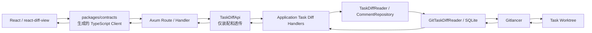

# Task Worktree / Gitlancer Diff 前后端链路

## 目标

Task Diff 以 `taskId` 为业务入口。前端不传递本机 worktree 路径，也不直接调用 Gitlancer：

- Worktree 是 Task 拥有的后端资源，不提供独立的前端 CRUD。
- Application 层校验 Task 与 Worktree 的归属关系并解析真实路径。
- Gitlancer 只负责 Git 命令、worktree 安全边界和 Unified Diff 输出。
- Rust contracts 是 HTTP 与 TypeScript SDK 的唯一数据源。
- 前端使用 `react-diff-view` 解析标准 Unified Diff；单栏、双栏和样式均由前端控制。

## 调用链路



主要实现位置：

| 职责 | 文件 |
|---|---|
| Axum 路由 | `apps/web/server/src/routes.rs` |
| HTTP 请求适配 | `apps/web/server/src/handlers/task_diffs.rs` |
| Web 依赖装配与透传 | `apps/web/server/src/service/task_diff.rs` |
| Application 用例 | `crates/application/src/task_diff/handlers.rs` |
| Application ports | `crates/application/src/task_diff/ports.rs` |
| Gitlancer adapter | `crates/application/src/task_diff/git_reader.rs` |
| Unified Diff 实现 | `crates/gitlancer/src/git/diff.rs` |
| Rust contracts | `crates/contracts/src/task_diff.rs` |
| SQLite 评论仓储 | `crates/db/src/repository/task_diff_comment.rs` |
| 生成的 TypeScript 类型 | `packages/contracts/src/task_diff.ts` |

## 固定基线

创建 Task worktree 时，后端先读取项目仓库当前 `HEAD`，再创建 linked worktree，并把该 commit 保存为 Worktree 的 `base_commit_id`。

之后所有 Task Diff 都比较：

```text
base_commit_id -> task worktree 当前文件状态
```

因此 patch 同时覆盖：

- 基线之后已经提交的改动；
- staged 改动；
- unstaged 改动；
- 未跟踪的文本和二进制文件。

基线不会随 Task 分支的新提交移动。`headCommitId` 只描述当前分支 `HEAD`，`diffId` 则由带字段边界的 base、head 和完整 patch 共同计算，用于识别评论所对应的 diff 快照。创建评论时后端会重新计算当前快照；发生变化时返回 `409 task_diff_stale`，不会保存过期锚点。

Gitlancer 对 tracked 文件直接比较固定基线，对 untracked 文件使用隔离于仓库配置的 `git diff --no-index` 生成 patch。整个流程不会修改 staging 区，也不会触发仓库 clean/textconv/external diff，并保留特殊路径、符号链接、可执行位和前端可识别的二进制标记。响应 patch 上限为 10 MiB，超限返回 `413 task_diff_too_large`。

Git 进程的 stdout 和 stderr 使用有界并发读取；任一输出超过预算时，后端会终止并回收 Git 子进程。评论创建时，后端除校验 `diffId` 外，还会在当前 Unified Diff 中验证文件、hunk、old/new side、完整行范围和首行内容。客户端提供的锚点无法指向不存在的代码。数据库通过复合外键保证父评论存在且属于同一 Task，并通过触发器禁止 reply 指向另一条 reply。

重命名文件的评论路径遵循 diff side：`side = old` 时提交旧路径，`side = new` 时提交新路径。HTTP adapter 会把所有 Task diff Git/SQLite 操作交给 Tokio blocking worker，避免阻塞异步请求线程。

历史 worktree 的基线通过 `WorktreeBaseline::unavailable()` 表示，而不是空字符串；只有新建 Task 能通过校验构造记录状态。内部字段保持私有，因此调用方无法绕过构造器制造空的 recorded baseline。历史 Task 不会被猜测性地绑定到错误 commit，尝试读取其 diff 时返回 `409 task_diff_baseline_unavailable`。

## Diff API

```http
GET /api/tasks/{taskId}/diff
```

响应示例：

```json
{
  "baseCommitId": "52f513f56f...",
  "headCommitId": "a428091162...",
  "diffId": "fnv1a64:1b0c9b7f0a2d4e11",
  "patch": "diff --git a/src/main.rs b/src/main.rs\n..."
}
```

`patch` 是标准 Unified Diff。后端不为 `react-diff-view` 生成专用 AST，前端可以直接使用组件提供的 `parseDiff`：

```ts
const files = parseDiff(response.patch);
```

契约包使用 `react-diff-view` 自带的 `parseDiff` 对后端标准 patch 进行集成测试，覆盖文本、空文件和二进制文件，避免后端格式与实际前端解析器发生漂移。

这样后端 contract 不依赖某个前端组件的内部类型；将来替换组件时也不需要修改 Git 领域接口。

生成的 SDK 调用为：

```ts
const diff = await client.task.getDiff({ taskId });
```

## 评论 API

评论由根讨论和回复两种状态组成。只有根讨论拥有行锚点和 `open` / `resolved` 状态，回复只引用父评论。

```http
GET  /api/tasks/{taskId}/diff/comments
POST /api/tasks/{taskId}/diff/comments
POST /api/tasks/{taskId}/diff/comments/{commentId}/replies
PUT  /api/tasks/{taskId}/diff/comments/{commentId}/status
```

创建根讨论：

```json
{
  "anchor": {
    "diffId": "fnv1a64:1b0c9b7f0a2d4e11",
    "path": "src/main.rs",
    "side": "new",
    "startLine": 24,
    "endLine": 26,
    "hunkHeader": "@@ -20,5 +20,8 @@",
    "lineContent": "let result = run();"
  },
  "body": "这里是否需要传播错误？"
}
```

根讨论响应中的 `kind`：

```json
{
  "kind": "thread",
  "anchor": { "diffId": "...", "path": "src/main.rs", "side": "new" },
  "status": "open"
}
```

回复响应中的 `kind`：

```json
{
  "kind": "reply",
  "parentCommentId": "comment-id"
}
```

解决或重新打开讨论的请求体：

```json
{ "status": "resolved" }
```

## 前端对接约定

前端负责以下展示逻辑，不影响后端数据模型：

- 使用 `react-diff-view` 的 `viewType="unified"` 或 `viewType="split"` 切换单栏/双栏。
- 根据 `path + side + line number` 把根讨论插入对应代码行。
- 按 `parentCommentId` 把回复组合到根讨论下。
- `comment.anchor.diffId !== currentDiff.diffId` 时，将讨论显示为过期锚点，避免错误绑定到已经变化的代码行。
- 评论样式、头像、输入框和解决按钮由前端自定义渲染。

后端不会接收以下内容：

- worktree 绝对路径；
- Git 仓库绝对路径；
- 前端组件生成的 DOM 或组件实例；
- 单栏/双栏等纯展示设置。

## 当前边界

当前版本实现读取和评论，不包含：

- 按 hunk 接受或拒绝改动；
- 在 Diff 中直接编辑代码；
- 三方冲突解决；
- 评论删除或编辑；
- 用户身份、多人权限和远端 Review 同步。

这些能力如果后续需要，应作为独立 Application 用例扩展，而不是放入 Web service 中实现 Git 业务逻辑。
